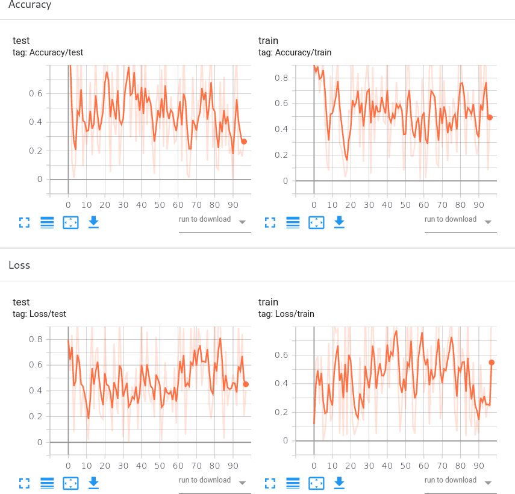

# Event reader example: Extracting training curves from the TensorBoard log

For common deep learning training tasks, we can save event files and visualize them
with [TensorBoard](https://github.com/tensorflow/tensorboard).

For example, the code `./generate_tensorboard.py` from
[PyTorch summary writer tutorial](https://pytorch.org/docs/stable/tensorboard.html)
generates sample TensorBoard event files in `logs` directory.

```sh
python3 generate_tensorboard.py
tensorboard --logdir logs
```



On the other hand, we may want to analyze data from event files. We can read event files
as though they are TFRecord files. This example lists available tags from a event file
just generated in `logs` directory.

```sh
cargo run \
    --example event_reader \
    --features with-serde \
    -- \
    --event event_reader/logs/events.out.tfevents.1600000000.my-pc.4244.0
```

It shows available tags in the terminal.

```sh
The tags inside this event are {
    "Accuracy/test",
    "Accuracy/train",
    "Loss/test",
    "Loss/train",
}
Please specify the tags to be extracted.
```

Then, we can specify wanted tags to export training curves to CSV files.

```bash
cargo run --example event_reader \
    --features with-serde \
    -- \
    --event event_reader/logs/events.out.tfevents.1600000000.my-pc.4244.0 \
    --tags Accuracy/test Accuracy/train
```

The generated CSV files are saved in the `output` directory.

- `output/Accuracy-test.csv`


```csv
step,value
0,0.11688784
1,0.5557087
2,0.59206223
...
```

- `output/Accuracy-train.csv`

```csv
step,value
0,0.9095652
1,0.8410302
2,0.13530093
...
```
